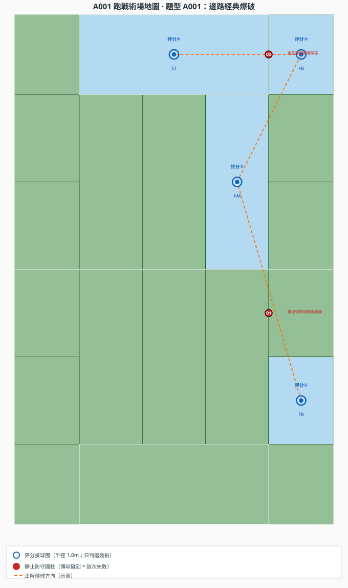
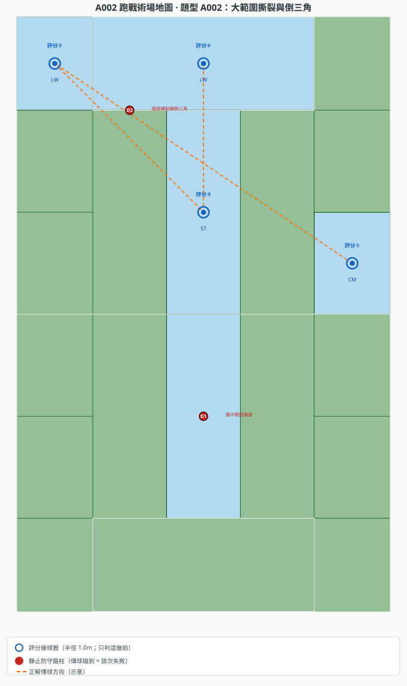
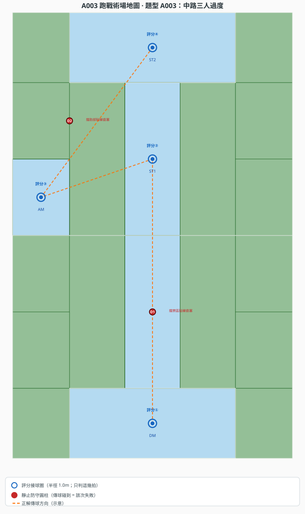
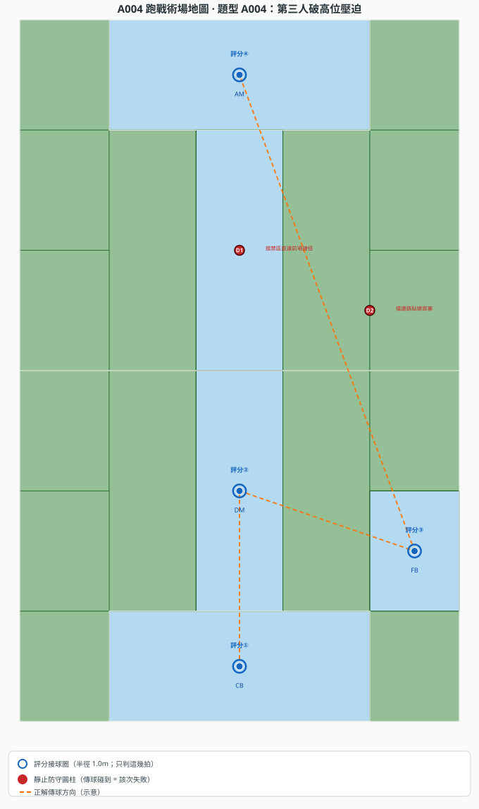
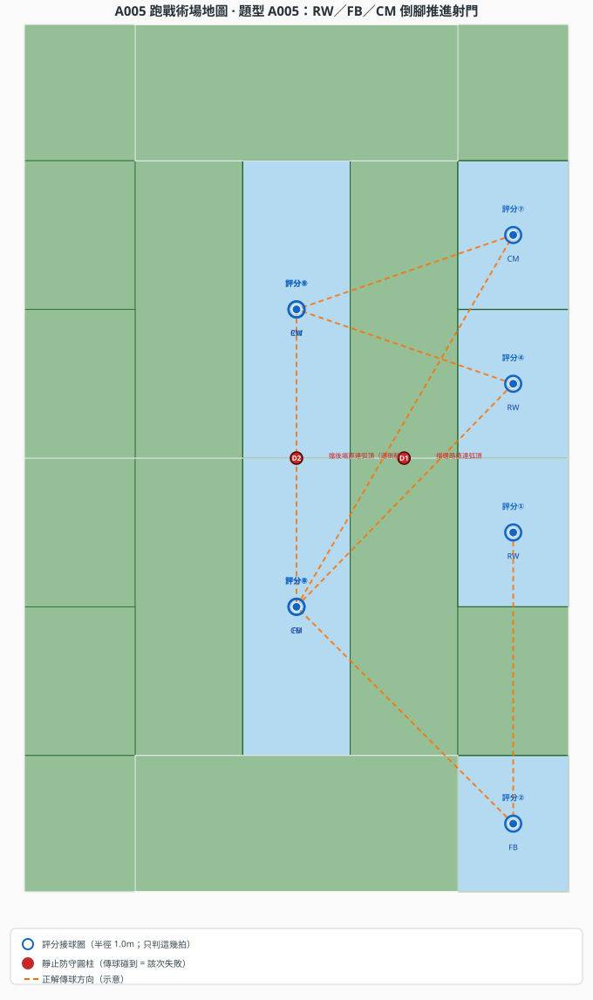
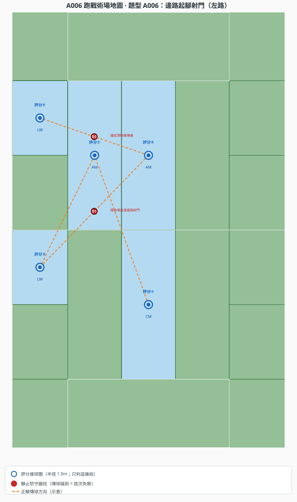
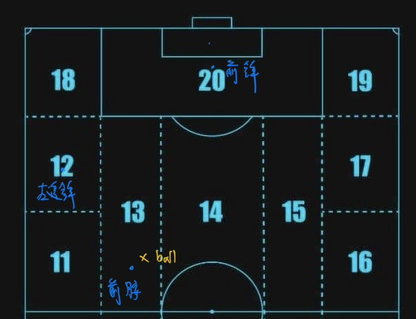

### 戰術復刻
戰術復刻流程分為兩個步驟，分別為畫跑位及跑帶傳。此部分共有6個戰術，每一個戰術有3分鐘可以完成。場上會有約**10名**靜止的防守球員，開題前依題目示意擺在特定位置；**全程不移動**。每個防守球員都是有高度的圓柱體，其位置的連線構成防線，且空間定義如下圖。


#### 畫跑位
牆上會有戰術描述，需請小隊員去找這些戰術描述並依照下方跑位定義在戰術板上畫出**每次接球**時的位置。評分採**傳球點模式**：每次只記錄接球者（點）、接球位置、以及該拍之前的傳球方式（邊）；**不需畫全員跑位**。人需標註角色（如前鋒、前腰等）。畫跑位評分方式如下：
1. 每次接球時，**球心**須落在該 zone 對應的格子內，否則該拍不予計分。
2. 將相鄰兩次接球間的球路轉譯成戰術語言（邊），若找不到相符名詞，則該段記為無。
3. 轉譯記錄**點**（接球者＋位置）及**邊**（傳球方式），會依照正確比例進行部分給分。

**場地名稱**（戰術描述用語）：後場中路、左肋深處、左邊路、左肋、弧頂前緣、右肋、右路中路、右邊路、左路底線、右路底線、禁區中央。

戰術語言（邊）定義如下：
* **傳球**：球由球員1的腳邊移動至球員2的腳邊，雙方皆需觸碰到球；未符合下列特殊傳球時，一律標為傳球。
* **射正**：終點在禁區中央，球進入球框範圍。
* **得分**：終點在禁區中央，球進入球框之特定範圍。
* **直塞(line breaking pass)**：傳球向前且穿越防線。執法：終點比起點更靠近球門，且終點在弧頂前緣或禁區中央。
* **回做球**：球由前方區域往回傳給身後隊友。執法：常見如弧頂前緣 → 左肋深處／右肋。
* **盤帶推進**：同一接球者連續兩次觸球，球與人同步推向球門。執法：兩拍為同一人，且後一拍比前一拍更靠近球門。
* **強弱邊轉移(Switch of play)**：長傳橫跨半場，利用弱側空間。執法：如右邊路／右路中路 → 左邊路／左路底線；或後場中路長傳至左路底線。
* **倒三角傳球(Cut-back)**：自底線或禁區深處貼地回傳弧頂前緣。執法：起點在左路底線／右路底線／禁區中央，終點在弧頂前緣。
* **傳中 (Cross)**：邊路傳球至禁區中央。執法：起點在左路底線或右路底線，終點在禁區中央。
* **過頂長傳 (Lobbed Pass / Over the top)**：中低位起腳，縱深大跳躍越過防線。執法：常見如後場中路 → 左路底線。
* **第三人出球（破高位壓迫）**：在逼搶壓力下，第二人短傳給已拉開的第三人脫困。執法：常見後場禁區 → 後場中路 → 邊路後段／邊後衛，再接肋部推進。

戰術描述寫法：依序寫明「傳球人將球【邊】給接球人，接球人在【位置】」，終點可標【射正】或【得分】。範例：

> 前腰將球直塞給左邊鋒，左邊鋒在左路底線接球。左邊鋒傳中給前鋒，前鋒在禁區中央得分。

#### 跑戰術

球員在固定時間內，依戰術板執行戰術。以每次不同球員的**第一次觸球**為一次接球，事後轉譯為戰術語言並評分。

**判定負擔控制（關主用）**

1. **只判評分點**：每題僅判 `run_tactic.score_touches` 所列的評分拍；其餘觸球不計分、不判。
2. **球心進格**：觸球瞬間**球心**須落在該 zone 對應的**格子內**（不必在格子正中心）。
3. **靜止防守圓柱**：場上約 10 根圓柱，開題前依題目圖擺好、**全程不移動**；**傳球路徑碰到圓柱 = 該次傳球失敗**，重來。
4. **不判全場 20 格**：僅評分拍須球心進格；練習與複賽可錄影事後對照。

**跑戰術評分流程**

| 步驟 | 關主做什麼 |
|------|------------|
| 開題前 | 依示意圖擺好約 10 根靜止圓柱 |
| 執行中 | 盯評分觸球：球心進格了嗎？傳球有沒有撞柱？ |
| 結束後 | 依戰術描述轉譯邊／點，與畫跑位相同 rubric 給分 |

**圓柱與評分點圖例**

- 藍圈：評分 zone（只判這幾拍；球心須在該格內）
- 紅點 D1、D2：靜止防守圓柱
- 橘虛線：正解傳球方向（示意）

##### A001 邊路經典爆破



- 評分① FB @ 右邊路後段（9）→ 評分② AM @ 右肋（15）→ 評分③ FB @ 右路底線（19）→ 評分④ ST @ 禁區中央（20）
- D1 @ 9｜15 邊界：擋邊後衛貼線傳肋部
- D2 @ 19｜20 共用邊界：擋底線橫傳進禁區

##### A002 大範圍撕裂與倒三角



- 評分① CM @ 右路中路（16）→ 評分② LW @ 左路底線（18）換邊 → 評分③ ST @ 弧頂（14）倒三角 → 評分④ LW 跑進禁區（20）接球得分
- D1 @ 後場中路（7）：擋中路短換邊
- D2 @ 18｜14 邊界：擋底線貼線倒三角

##### A003 中路三人過度



- 評分① DM @ 後場禁區（2）→ 評分② ST1 @ 弧頂（14）→ 評分③ AM @ 左肋深處（11）→ 評分④ ST2 @ 禁區中央（20）射正
- D1 @ 後場中路（7）：擋禁區貼線直塞
- D2 @ 11｜20 邊界：擋肋部貼線直塞

題目 YAML 的 `run_tactic:` 區塊為場地擺設欄位；**評分接球點 = `pass_points` 每一拍**。重產 A 組示意圖：

##### A004 第三人破高位壓迫



- 評分① CB @ 後場禁區（2）→ 評分② DM @ 後場中路（7）→ 評分③ **FB @ 右邊路後段（9）第三人出球** → 評分④ **AM @ 禁區中央（20）直塞射正**
- D1 @ 弧頂前緣（14）：擋禁區直連前場捷徑（逼須走第三人）
- D2 @ 9→20 通道：擋邊路貼線直塞

##### A005 RW／FB／CM 倒腳推進射門



**傳球點**：① RW@10 → ② FB@3 → ③ CM@7 → ④ RW@16 → ⑤ CM@14 → ⑥ FB@7 → ⑦ CM@17 → ⑧ **RW@14 射正**

**三人跑位（同一組 RW／FB／CM）** — 詳見 `final_document/a005.yaml` 的 `run_movement`

| 時刻 | RW | FB | CM |
|------|----|----|-----|
| 開球 | **(10)** 持球 | (3) 要球 | (7) 策應 |
| ②→③ | (10)→**(16)** | (3) 接球→傳出 | **(7)** 接球 |
| ④→⑤ | **(16)** 接球→傳出 | (7) 站穩 | **(14)** 接球 |
| ⑥→⑦ | (16)→**(14)** | **(7)** 接球 | (14)→**(17)** |
| ⑧→終 | **(14)** 接球**弧頂射正** | 後場支援 | 弧頂外策應 |

- D1 @ 10→14：擋邊路直連弧頂
- D2 @ 7→14：擋後場直連弧頂（逼倒腳）

##### A006 邊路起腳射門（左路鏡像）



**傳球點**：① CM@7 → ② AM@13 → ③ **LW@5** → ④ AM@14 → ⑤ **LW@12 射正**

（右路原型：AM@15 → **RW@10** → AM@14 → RW@17）

- LW 由(5)拉邊至 **(12)** 起腳；不必進禁區
- D1 @ 7→12：擋後場直連邊路射門
- D2 @ 14→12：擋弧頂貼線傳邊

```bash
.venv/bin/python -m tactic_translate.plot_run_tactic a00{1..6}.yaml
```

##### A001～A006 評分接球點一覽

| 題目 | 評分接球點（只判這些 zone） | 示意圖 |
|------|---------------------------|--------|
| A001 | ① FB@9 → ② AM@15 → ③ FB@19 → ④ ST@20 | [A001](run_tactic_figures/A001_run_tactic.svg) |
| A002 | ① CM@16 → ② LW@18 → ③ ST@14 → ④ LW@20 | [A002](run_tactic_figures/A002_run_tactic.svg) |
| A003 | ① DM@2 → ② ST1@14 → ③ AM@11 → ④ ST2@20 | [A003](run_tactic_figures/A003_run_tactic.svg) |
| A004 | ① CB@2 → ② DM@7 → ③ FB@9 → ④ AM@20 射正 | [A004](run_tactic_figures/A004_run_tactic.svg) |
| A005 | ① RW@10 → ② FB@3 → ③ CM@7 → ④ RW@16 → ⑤ CM@14 → ⑥ FB@7 → ⑦ CM@17 → ⑧ RW@14 射正 | [A005](run_tactic_figures/A005_run_tactic.svg) |
| A006 | ① CM@7 → ② AM@13 → ③ LW@5 → ④ AM@14 → ⑤ LW@12 射正 | [A006](run_tactic_figures/A006_run_tactic.svg) |

##### 練習題 T002～T015（參考）

| 題目 | 評分接球點 | 示意圖 |
|------|-----------|--------|
| T002 | ① RW@19 → ② AM@20 | [T002](run_tactic_figures/T002_run_tactic.svg) |
| T005 | ① W@19 → ② CM@14 → ③ W@20 | [T005](run_tactic_figures/T005_run_tactic.svg) |
| T006 | ① ST@14 → ② AM@11 → ③ ST@20 | [T006](run_tactic_figures/T006_run_tactic.svg) |
| T007 | ① ST@14 → ② AM@11 → ③ ST@20 | [T007](run_tactic_figures/T007_run_tactic.svg) |
| T008 | ① CM@11 → ② AM@14 → ③ RB@19 → ④ ST@20 | [T008](run_tactic_figures/T008_run_tactic.svg) |
| T009 | ① DM@7 → ② CB@7 → ③ FB@7 → ④ W@18 | [T009](run_tactic_figures/T009_run_tactic.svg) |
| T010 | ① RW@17 → ② RB@19 → ③ ST@20 | [T010](run_tactic_figures/T010_run_tactic.svg) |
| T011 | ① DM@7 → ② CB@7 → ③ LW@18 → ④ ST@20 | [T011](run_tactic_figures/T011_run_tactic.svg) |
| T012 | ① LW@18 → ② AM@14 → ③ RW@17 → ④ RW@20 | [T012](run_tactic_figures/T012_run_tactic.svg) |
| T015 | ① AM@14 → ② LW@11 → ③ ST@14 → ④ AM@13 → ⑤ LW@18 → ⑥ ST@20 | [T015](run_tactic_figures/T015_run_tactic.svg) |

各題圓柱位置見對應 `a00x.yaml`（A 組）或 `00x.yaml`（T 組練習題）的 `run_tactic.defenders` 或示意圖紅點。

每次戰術描述的給分如下，6次戰術描述共450分。小隊可讀 [`戰術復刻評分說明.md`](戰術復刻評分說明.md)；場地圖見 [`zone_map.pdf`](final_document/zone_map.pdf)；戰術語言見 [`戰術語言.pdf`](戰術語言.pdf)。


| 畫跑位 | 跑戰術| 越位 |
| -------- | -------- | -------- |
| 15     | 30     | 30     |


以下是一範例題（傳球點版）

> 前腰將球直塞給左邊鋒，左邊鋒在左路底線接球。左邊鋒傳中給前鋒，前鋒在禁區中央得分。

戰術板如下



關卡特例只改變可用工具，不改變本文件其他判定規則。開始前必須向所有人說明。


跑戰術的可行解為這場[MCI vs LIV](https://drive.google.com/file/d/1wTNPIv8mP8iGepxY3-YXf0nhpvWCo9Qu/view?usp=sharing)的比賽。
