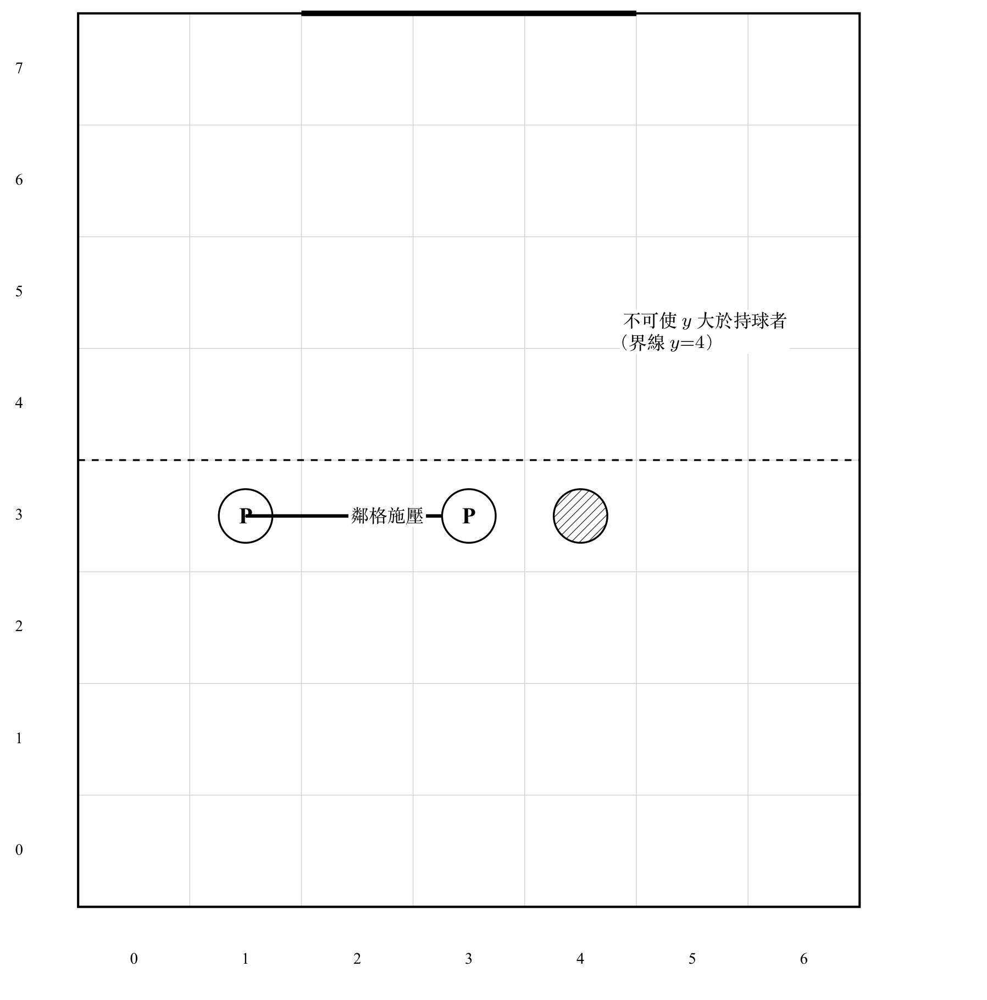
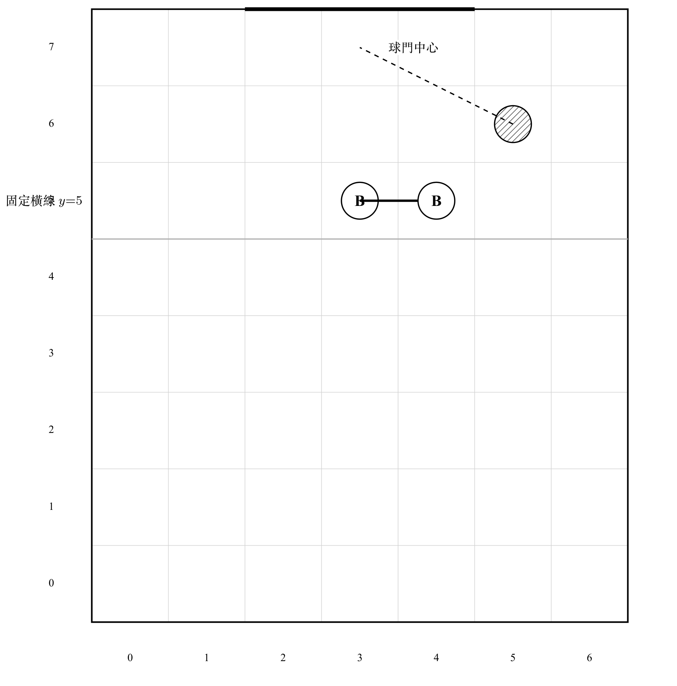
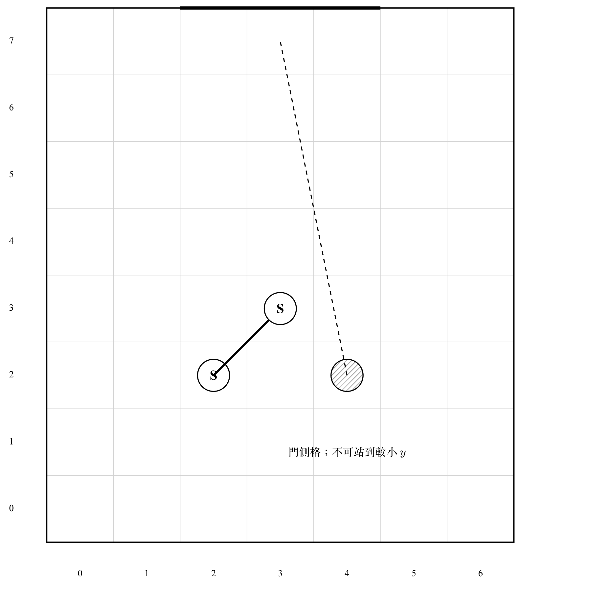
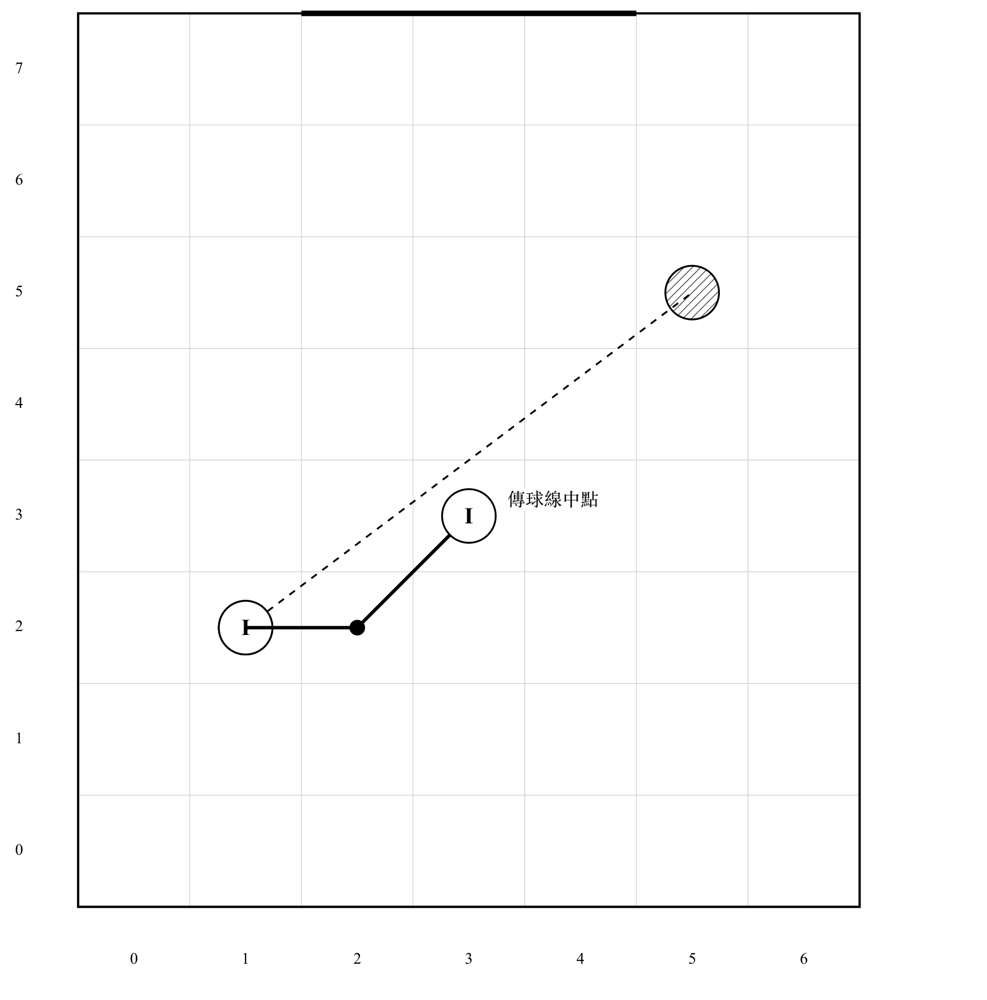
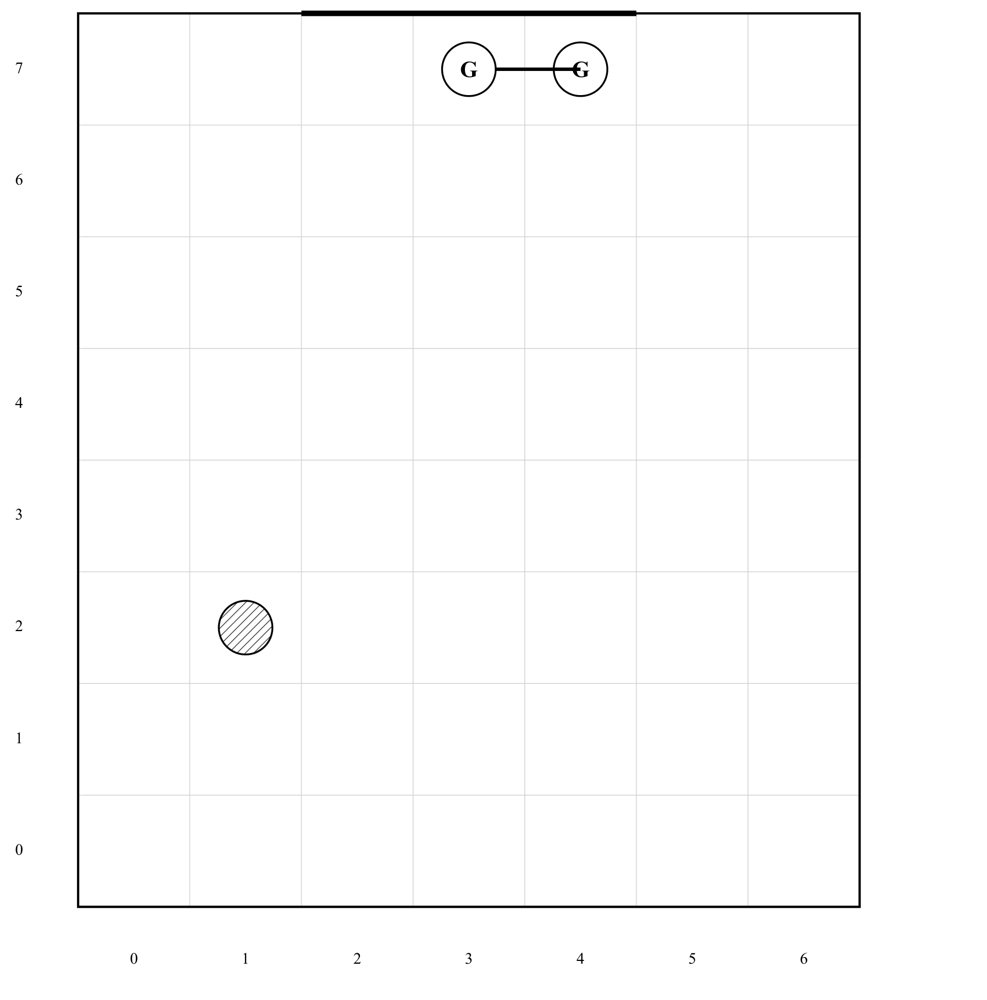

# 防守題評分方式
## 零、重點內容
本題的重點為第一大點至第四大點，第五大點後僅是防守球員移動方法，不需細看。

## 一、遊戲目的

進攻方必須在指定回合數內，利用盤帶、無球跑位及傳球改變站位，最後完成射門得分。

- 射門進球：立即過關。
- 盤帶踏入防守格、移動階段結束時貼身壓迫條件成立、傳球失敗、射門未進：立即失敗。
- 回合用盡仍未進球：失敗。

## 二、場地與座標

### 2.1 棋盤

- 場地為 **7 格寬 × 8 格深**（實體格線或等價標記）。
- 橫向座標為 `x = 0～6`，由左至右增加。
- 縱向座標為 `y = 0～7`，越接近 `y=7` 越接近對方球門。
- 任一球員的位置以 `(x,y)` 表示。

### 2.2 球門

球門位於最深一排 `y=7`，包含三格：

- 左柱：`(2,7)`
- 中路：`(3,7)`
- 右柱：`(4,7)`

射門目標必須對應上述球門區。守門員站位亦限於這三格。

### 2.3 移動距離

「移動 1 格」採八方向計算：

- 包括上、下、左、右及四個斜向；

## 三、球員與佔位
違反以下規則者黃牌一張。
### 3.1 持球者

- 任何時刻僅一名進攻球員持球。
- 開局站位、持球者由關卡指定。
- 傳球成功後，接球者立即成為新持球者。

### 3.2 格子佔用

- 格子上不得有兩名或以上球員。

### 3.3 所屬方格

- 每名球員在任何時刻屬於一個指定方格。
- 雙腳必須站在該格內。
- 在非移動階段時，球員不得擅自離開原所屬格。

## 四、回合結構

### 4.1 回合計數

正式關卡均以 **8 回合**為上限（關卡另有明文者從其規定）。關卡的步驟包含以下階段，上一階段結束時進入下一階段，且在每個階段開始時關主皆會宣告並請小隊員選擇執行或跳過。選擇執行時關主會確認成功與否。

### 4.2 射門階段

- 只要選擇射門，回合立即結束。
- 整顆球進入球門範圍內則得分，。
- 持球者必須位於 **`y ≥ 4`** 才能射門。

### 4.2 移動階段

在此階段所有隊員皆可移動，每位小隊員僅能移動一次。持球者移動定義為盤帶，非持球者移動定義為無球跑位。兩者合法操作分別如下

- 目標在棋盤內；
- 與原位置相距恰好 1 格；
- 關卡未禁止盤帶。

惟盤帶時需做關主指定繞錐帶球動作，過程中不得碰到任何角錐（待定）。

### 4.3 傳球階段

傳球階段由以下傳球相關規定認定

#### 4.3.1 傳球程序

持球者宣告接球隊友；

#### 4.3.2 傳球結束

同時符合：

1. 接球者需觸球； 
2. 球停止移動；

結束後：

1. 接球者成為持球者；
2. 回合結束。

### 4.4 結束回合

- 防守方統一移動；
- 回合數+1。

## 五、防守球員共同規則

### 5.1 防守反應與重疊結算

防守反應時，依下列程序結算：

1. **計算首選**：每位防守者依角色規則算出首選目標格，以及本次反應的最大步數。
2. **全體離格**：所有防守者同時離開原格。
3. **依優先序佔格**：門將 → 大閘 → 逼搶員 → 攔截者 → 影子。同角色依防守者編號（id）字典序，較前者先佔。
4. **後佔者可用先佔者騰出的格**：因已全體離格，先結算者未選的原格，後結算者可以進入。
5. **不得站入進攻球員所在格**。
6. **不允許兩名防守者重疊**。

#### 本次最大步數

| 角色 | 最大步數 | 角色區域 |
|------|----------|----------|
| 門將 | 1 | 僅球門三格 `(2,7)(3,7)(4,7)` |
| 大閘 | 1 | 僅其固定橫線 `y` |
| 逼搶員 | 2 | 全場（不可進球門格、不可佔持球者格） |
| 攔截者 | 距卡位目標 ≥2 則 2，否則 1 | 全場（不可進球門格） |
| 影子 | 1 | 全場（不可進球門格；不可站到被盯者球側） |
| 定點大閘 | 0 | 關卡指定格，永不離格 |

距離採八方向（切比雪夫距離）：斜走 1 格也算 1 步。

#### 落點判定

每位防守者依序決定落點：

1. 若首選格 → 站首選；
2. 否則，只在「距原位 ≤ 本次最大步數」且符合角色區域的**空格**中選替代格；
3. 替代格排序（愈前愈優先，全部為硬性比較，無裁量）：
   1. 落在該角色偏好路線上（攔截者：傳球線中段格；影子：被盯者→球門中心路線上的格；其餘角色無此項）；
   2. 距首選目標較近；
   3. 不往比首選更淺的 `y` 後退；
   4. 距原位較近（移動較短）；
   5. `y` 較大，再比 `x` 較小；
4. 若合法範圍內沒有空格 → 若原位仍空則留在原位；定點者永遠留在原位。  
   （在 7×8 與上述優先序下，原位被佔且無替代格的情況不應發生；若發生則屬執行錯誤，不得用瞬移或跨區解決。）

**禁止**為了避開重疊而：

- 超過該角色本次最大步數；
- 離開大閘的固定橫線；
- 讓非門將進入球門三格；
- 讓門將離開球門三格；
- 佔用定點大閘的格子。

## 六、防守角色

### 6.1 瘋狗逼搶員（Presser）

- 每次防守反應最多移動 2 格；
- 可直走或斜走；
- 朝持球者靠近；
- 不會主動站入持球者所在格，而會停在鄰近位置施壓；
- 不會越過持球者所在的縱深線（不得使自己的 `y` 大於持球者的 `y`）。

貼身壓迫：

- 若行動開始時逼搶員已與持球者相鄰，持球者選擇結束回合或在貼身狀態下硬盤，且行動後仍未擺脫相鄰範圍，**立即判定被搶斷，關卡失敗**；
- 及時傳球可解除原持球者所受的貼身判定。

逼搶員在傳球／射門時，只能在自己的格內實際攔截或封堵，不自動截斷。

### 6.2 區域大閘（Block）

- 每名大閘有一條固定橫線 `y`；
- 不向前或向後移動；
- 每次反應最多橫移 1 格；
- 目標是站到「球的位置—球門中心 `(3,7)`」連線穿過其橫線的位置；
- 若首選格被佔，依第八章重疊結算，在同一橫線、且距原位 ≤ 1 格的空格中改站。

定點大閘（anchored）：

- 完全不移動，全程留在關卡指定格；
- 傳球／射門時仍可在該格內實際攔截或封堵。

### 6.3 影子盯人者（Shadow）

- 每名影子固定盯一名進攻球員；
- 未預先指定時，開局選擇最近的進攻球員；
- 盯人關係確立後不任意更換；
- 每次防守反應移動最多 1 格；
- 目標格為被盯球員朝球門中心方向的下一格；
- 不主動站到被盯球員本人所在格；
- 不站到被盯球員的球側，也就是不站在比被盯者更小的 `y`；
- 最高只到 `y=6`，不進入球門格。

影子在跑位或盤帶的軟階段不動，只會在傳球或結束回合後跟上。

### 6.4 路線攔截者（Interceptor）

- 先排除目前持球者；
- 在其餘進攻球員中，優先選擇 `y` 最大、最接近球門者；
- 若危險程度相同，優先選擇較接近持球者者；
- 以持球者至該球員的傳球線中段作為卡位目標；
- 距離目標較遠時最多移動 2 格，較近時移動 1 格；
- 若首選格被佔，依第八章重疊結算，優先改站同一傳球線上、且在本次步數內的其他空格。

攔截者站在預判路線上**不**自動令傳球失敗；必須在場上實際碰到或控制球。

### 6.5 守門員（Goalkeeper）

- 只能站在三個球門格 `(2,7)`、`(3,7)`、`(4,7)`；
- 每次防守反應最多橫移 1 格；
- 球在左側時向 `(2,7)` 靠近；
- 球在中路時向 `(3,7)` 靠近；
- 球在右側時向 `(4,7)` 靠近；
- 不論球距離球門多遠，都會跟隨球的橫向位置。

門將站在某一球門格**不**自動撲出；射門時必須實際完成撲救或漏球。

