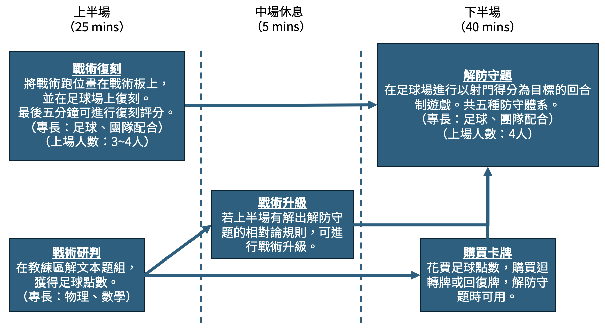
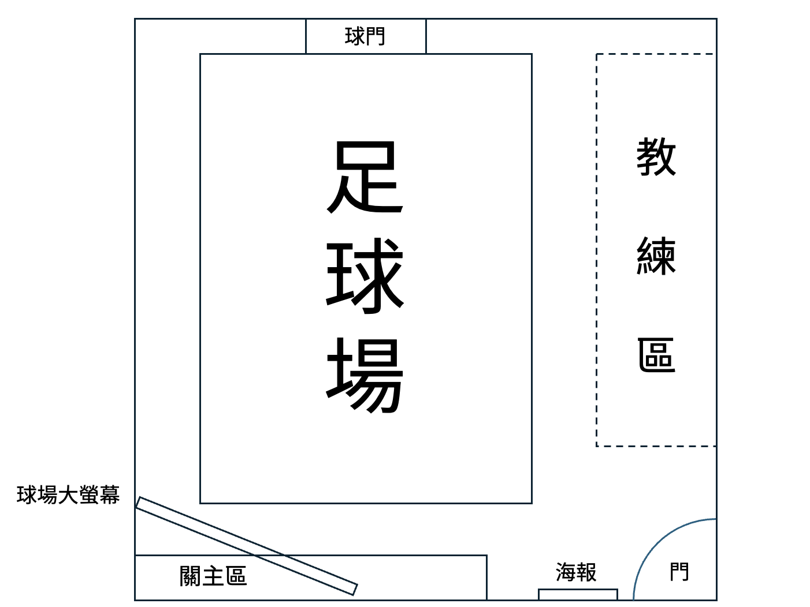
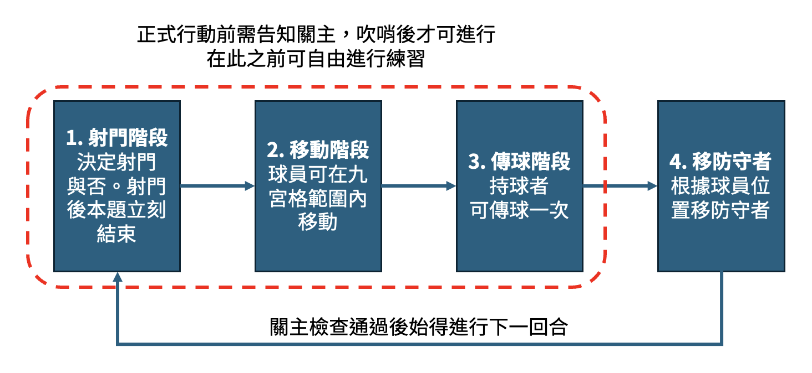

# 越lati位ty
## 關卡故事
你們被CERN製造的黑洞甩出來到外太空，並且被天狼星文明帶去比星際足球。星際足球最特別的地方是尺度非常大，因此你們要考慮相對論效應。比賽分為上下半場，上半場為戰術復刻與戰術研判，考驗你們技術動作及物理數學。下半場要針對不同的防守陣型設計不同戰術並執行，最終目標是攻破天狼星的大門。

## 關卡流程及場地圖

足球場中的藍線是上半場專用，白線及邊線是下半場專用。

## 闖關規則
1. 本關卡共75分鐘，前五分鐘為讀題時間，後續時間分配如關卡流程所示。
2. 讀題時間結束後可打王牌或魔法牌
3. 上半場建議分工：戰術復刻約2-3人，戰術研判約2-3人。
4. 破壞場佈則整關0分。

## 戰術復刻
戰術復刻流程分為兩個步驟，分別為畫跑位及跑戰術。有6個戰術，一個戰術100分，共600分。場上會有站在特定位置防守球員（都是3格高的紙箱）。

### 畫跑位
教練區有戰術描述，閱讀戰術描述並依照跑位定義在戰術板上畫出每次接球時人的位置。畫跑位一題25分。
畫跑位相關規定請見教練區「戰術復刻評分說明」。

### 跑戰術
球員要在10秒內完成戰術描述中的戰術。跑戰術一題75分，詳細規定請見「戰術復刻評分說明」。

### 紅牌
下列情形會得到紅牌一張

- 違反手球規定（詳見教練區「手球規定」）
- 撞倒防守球員

得到紅牌後，該題跑戰術立即結束。若該戰術描述未允許手球，則該題以零分計算。

## 戰術研判
教練區有文本題組，考點涵蓋物理與數學，共計400分。規則如下：

1. 所有文本題的答案請書寫於答案卷上
2. 請將所有欲批改的答案卷於上半場結束前交給關主，否則不予計分
3. 依據文本題得分，會得到等量的足球點數，可在解防守題時購買回復牌與迴轉牌（每張售價為30個足球點數）

其中「相對同時性與因果律」題組最重要，其最終目標為解出解防守題的「相對論規則」。若在上半場結束前有成功解出，則可進行「戰術升級」，將會降低下半場解防守題的難度。

## 中場休息
上半場結束後，會進入5分鐘的中場休息。建議可利用這段時間研究下半場解防守題的規則。此時關主也會公布以下事項：

1. 戰術復刻的得分
2. 戰術研判的得分及獲得的足球點數
3. 戰術升級是否成功

## 解防守題
為回合制遊戲，一共有五題防守題，一題180分，共900分。需依照場上形勢選擇戰術，並規劃跑位來解決問題。足球場上有數名防守球員，各具不同的性質，包括瘋狗逼搶員、區域大閘、影子盯人者、路線攔截者及守門員。各題的防守球員配置不一（詳見防守題評分方式），可自行決定解題順序。另外，開始解每一題前，可告知關主欲購買回復牌及迴轉牌。

每回合流程如下圖：

詳細規則請見「防守題評分方式」。

### 紅黃牌
解防守題時，關主會依照犯規情節，發給紅牌或黃牌。

下列情形會得到黃牌一張：

- 傳球階段時使球出界
- 傳球階段時使防守者倒地
- 移動階段時未依規定移動

得到黃牌後，場上狀態會復原至該階段開始前，並重新進行該階段。所有防守題中，每一題的黃牌數會分開累計。

下列情形會得到紅牌一張：

- 違反手球規定
- 該防守題中累計兩張黃牌

得到紅牌後，該防守題立刻結束並以零分計算。

### 卡牌功能
- 回復牌：回合中任何階段皆可使用，可回到上一回合的射門階段
- 迴轉牌：得到該防守題的第二張黃牌時可使用，使用後場上狀態會復原至該階段開始前，並重新進行該階段

## 計分方式
總分 = 戰術復刻 + 戰術研判 + 解防守題 + 成就分數。滿分為2000分。

### 戰術復刻
每個戰術畫跑位25分，跑戰術75分，共100分。6個戰術共600分。

### 戰術研判
共400分，每小題配分詳見文本題題目卷。

### 解防守題
若成功進球，每題防守題得分計算為
$180 \cdot R \cdot O  \cdot C$

回合折減係數$R$為：

- 戰術升級成功 = $1 - (n-4)\cdot 0.1$
- 戰術升級失敗 = $1 - (n-4)\cdot 0.2$
- 大於1以1計，小於0以0計

越位係數$O$為：

- 所有觀察者不越位 = 1
- 靜止觀察者不越位 = 0.6
- 越位 = 0.2

因果律係數$C$為：

- 所有傳球皆符合因果律 = 1
- 有至少一次傳球違反因果律 = 0.5

每題最低零分。若獲得紅牌或未進球，該防守題零分。

### 成就分數

|成就名稱|內容|分數|
|-|-|-|
|終場清道夫|協助關主場復|50分|
|全隊到齊|全隊以足球先發陣容的形式合影，並手持紀念旗（可向關主索取範例照片）|50分|

