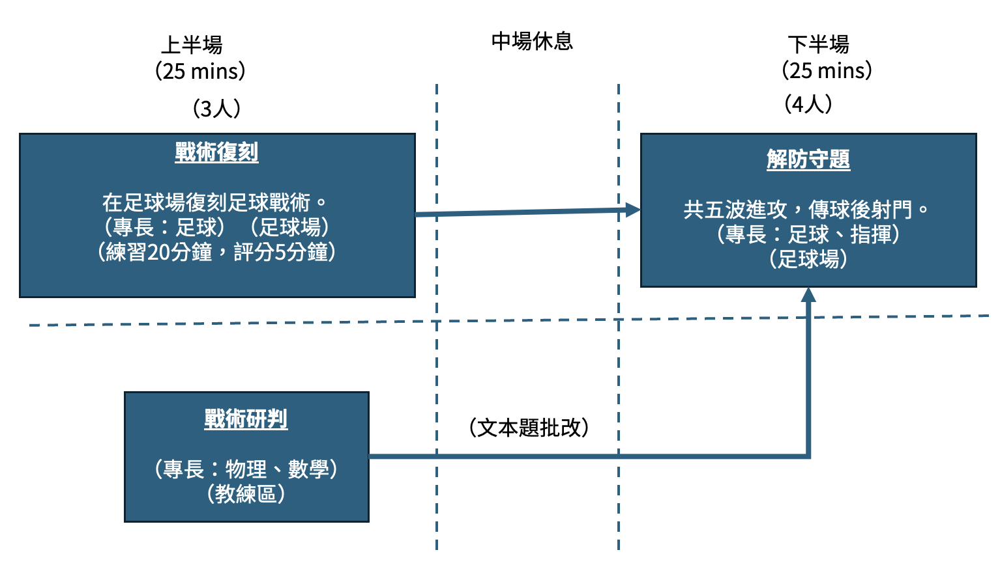
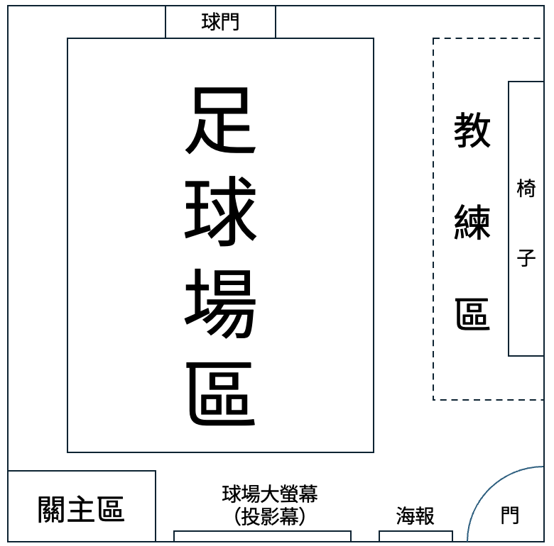

# 宇宙杯足球賽
## 主測
足球、物理、數學、指揮
## 關卡故事
你們被CERN製造的黑洞甩出來到外太空，並且被天狼星文明帶去比星際足球。星際足球最特別的地方是尺度非常大，因次你們要考慮相對論效應。你們比需完成球員、教練及裁判任務。比賽分為上下半場，上半場為戰術復刻與戰術研判，考驗你們技術動作及物理數學。下半場要針對不同的防守陣型設計不同戰術並執行，最終目標是攻破天狼星的大門。
## 關卡流程及場地圖

## 闖關規則
1. 本關卡共60分鐘，時間分配如關卡流程所示。
2. 前五分鐘可以打王牌或魔法牌。
3. 建議分工：戰術復刻約2-3人，物理文本約2-3人。
4. 破壞場佈則整關0分。

## 上半場
### 戰術復刻
戰術復刻流程分為兩個步驟，分別為畫跑位及跑戰術。共6個戰術，一個戰術45分。場上會有靜止的防守球員，會站在特定位置，每個防守球員都是3格高的紙箱。
#### 畫跑位
場地會有戰術描述，需請小隊員去找這些戰術描述並依照**跑位定義**在戰術板（位於戰術區）上畫出**每次接球**時人及球的位置。畫跑位一題15分。
畫跑位評分方式如下：
1. 球及人位置必須在各zone中心，否則不予計分。
2. 人需定義角色，否則不予計分。
3. 將每兩次接球時刻間球的移動及人的跑位轉譯成戰術語言。
4. 轉譯會記錄點（球員位置）及邊（傳球方式），會依照正確比例進行給分。
給分方式請見戰術區「戰術復刻評分說明」。

#### 跑戰術
球員要在每個戰術的指定時間內完成戰術語言中的戰術。以每次不同球員的第一次觸球作為**每次接球**時間，並記錄每次接球時球心位置。紀錄位置後將以畫跑位的評分方式做相同的評分。跑戰術過程動作需遵守戰術復刻評分說明中的跑戰術部分。跑戰術一題30分。

### 戰術研判
教練區有放置一些戰術資料，裡面有文本題，考點涵蓋物理與數學。其中一組與相對論有關，將作為下半場引入相對論概念的鋪陳。評分規則如下：
1. 所有文本題的答案請書寫於答案卷上
2. 請將所有欲批改的答案卷於上半場結束前交給關主，否則不予計分，點數兌換表請見教練區之「點數兌換表」。

## 下半場
### 解防守題
本輪為回合制遊戲，一共五題，一題90分，每題有8回合可以嘗試。教練需依照場上形勢選擇自身想打的戰術，並規劃你們的移動來解決問題。足球場區上有數名防守球員，每個防守球員會有不同的性質，包括瘋狗逼搶員、區域大閘、影子盯人者、路線攔截者及守門員。

而每回合分為進攻回合及防守回合，進攻回合步驟如下：

1. 射門階段
- 只要選擇**射門**，回合即結束。

2. 移動階段
- 此階段中每位球員可移動一次。

3. 傳球階段
- 可以傳球一次。

4. 結束回合
- 進攻回合結束後，防守方會進行移動

若能在越短的回合內得分及能符合相對論規則，則分數越高。

在回合結束後大螢幕會秀出防守者的更新位置，請小隊員依照上述位置排防守球員。小隊需依指示將防守者放在格子上後才能進行下一回合。詳細規則請見「防守題評分規則」。

#### 黃牌
下列情形會得到黃牌一張：
- 使球出界
- 使防守者倒地
- 未依規定移動球員

得到黃牌後，該回合會重新進行。

#### 紅牌
下列情形會得到紅牌一張：
- 以手或手臂碰觸球
- 一波進攻中累計兩張黃牌

得到紅牌後，該波進攻終止並以零分計算。

#### 迴轉牌
在一波進攻中得到第二張黃牌時，可於裁判舉起紅牌前打出一張迴轉牌，紅牌將會取消，接著重新進行該回合。

## 計分方式
### 上半場
每次戰術描述中畫跑位15分，跑戰術30分，6次戰術描述共270分。文本題一共180分。
### 下半場
每回合得分計算為
$90 \left(1-\sgn{\frac{回合數-5}}{10}\right)\cdot越位係數\cdot因果律係數$
越位係數為：
- 所有觀察者不越位 = 1
- 靜止觀察者不越位 = 0.6
- 越位 = 0.2

因果律係數為：
- 所有傳球皆符合因果律 = 1
- 有至少一次傳球違反因果律 = 0.5

共5題滿分450分。
場復100分。

